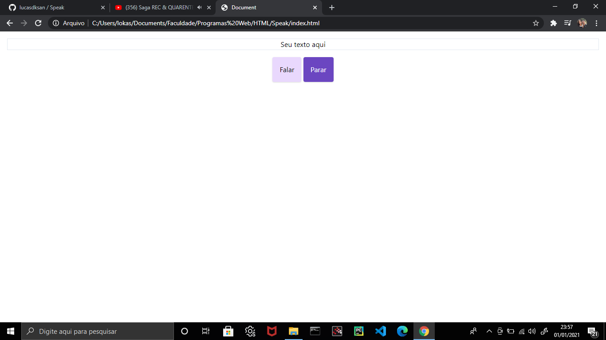

# Speak Simples :computer: :loudspeaker:

## Este projeto é resultado de estudos sobre o objeto SpeechSynthesisUtterance, responsável pela reprodução sonora de mensagens digitadas.

## O arquivo index.js contém três funções que são usadas diretamente no arquivo index.html.

### speak() É responsável pela reprodução sonora dos textos digitados nas principais input.
### stop() Para a reprodução sonora.
### setText() Recebe o texto digitado e prepara para fazer a reprodução sonora.

## Os arquivos index.html e styles.css são apenas para fins ilustrativos.